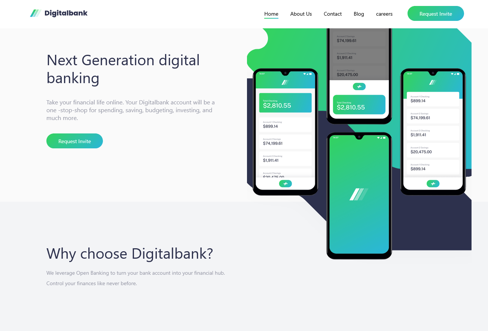

# Frontend Mentor - Digitalbank landing page solution

This is a solution to the [Digitalbank landing page challenge on Frontend Mentor](https://www.frontendmentor.io/challenges/digital-bank-landing-page-WaUhkoDN). Frontend Mentor challenges help you improve your coding skills by building realistic projects.

### The challenge

Users should be able to:

- View the optimal layout for the site depending on their device's screen size
- See hover states for all interactive elements on the page

### Screenshot

### Links

- Solution URL: https://github.com/cgojk/digitalBank.git
- Live Site URL: https://digitalbankcg.netlify.app/

## My process

### Built with

- Semantic HTML5 markup
- CSS custom properties
- Flexbox
- CSS Grid
- Mobile-first workflow

### What I learned

I learned a lot while building this project, especially about CSS Grid and React.

One of the most useful things I learned was using grid-area: 1 / 1 to place two images on top of each other. I used this to overlap the hero background image with the phone mockup without needing position: absolute.

I also spent quite a bit of time working on the hero section. At first, I was using a lot of translateX() and translateY(), but I found that it became difficult to manage across different screen sizes. Instead, I started using Grid properties like justify-self and align-self, which made the layout much easier to control. I'm still learning the best way to approach these kinds of layouts, but I think this method is much cleaner.

On the React side, I continued practicing building reusable components and keeping the code organized. I also added a custom 404 page so users get a better experience if they try to visit a page that hasn't been built yet.

Overall, this project helped me get more comfortable with responsive design, CSS Grid, media queries, and structuring a React application. It also reminded me that building a responsive hero section can be more challenging than it looks!

## Author

Catalina G

#
